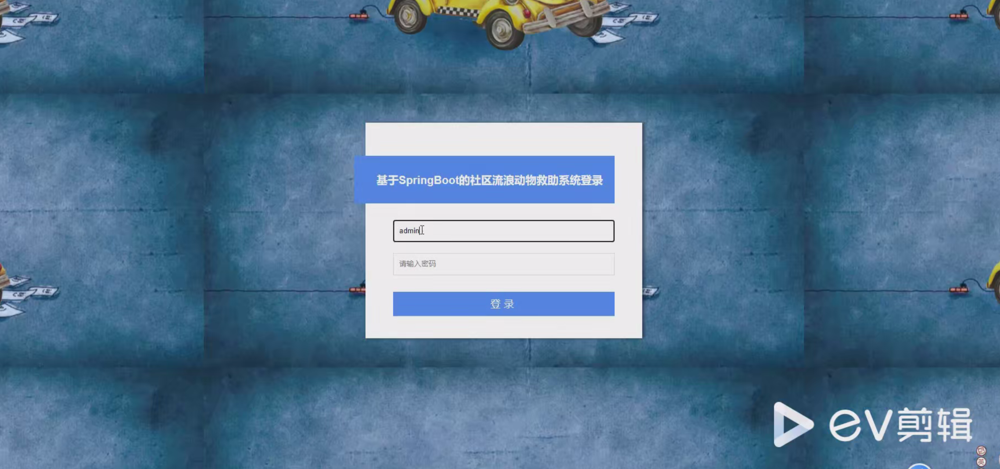
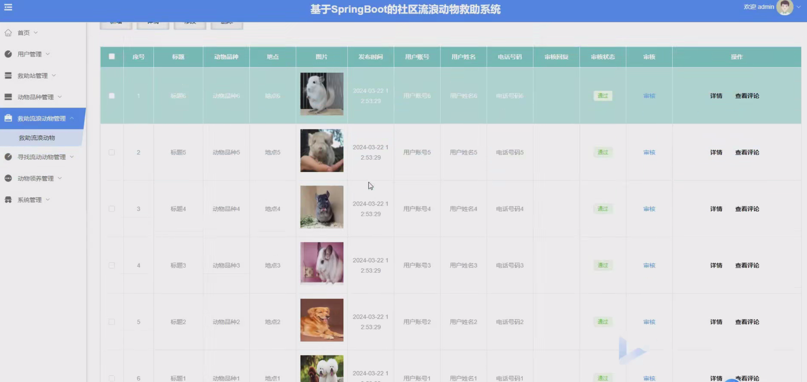
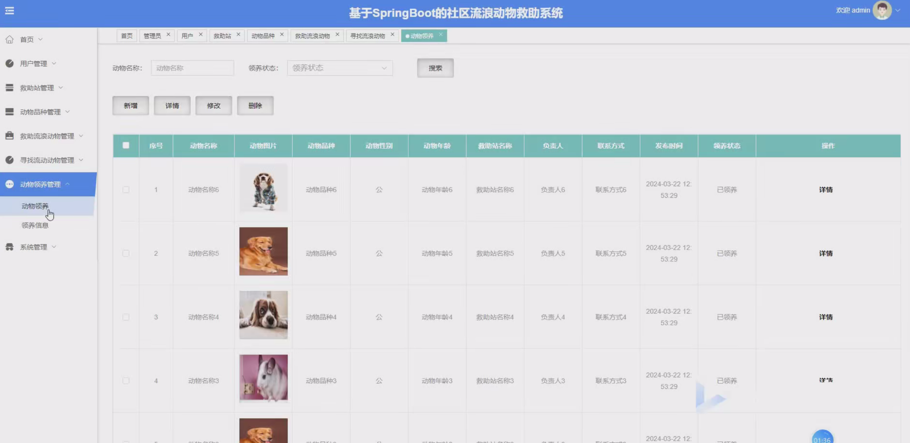
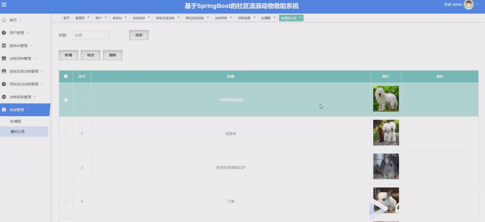

# 基于SpringBoot+Vue的社区流浪动物救助系统

#### 介绍
基于SpringBoot+Vue的社区流浪动物救助系统；附有完整源码➕数据库➕文档等。
本项目可以用于毕业设计，白嫖勿扰！
全网毕业设计项目这里都有

#### 课题背景
随着城市化进程的加速，流浪动物问题日益突出，已经成为社会治理的重要议题之一。如何通过技术手段更高效地开展流浪动物的救助和管理工作，成为政府、公益组织及爱心人士关注的重点。当前，流浪动物救助主要依赖传统方式，如人工记录、线下救助等。这种方式存在以下问题：信息管理分散：救助信息、领养信息、志愿者管理等缺乏统一的平台支持，容易造成数据丢失和管理混乱。沟通效率低下：爱心人士、志愿者、救助机构之间的沟通通常通过社交媒体或线下渠道，响应效率较低。综上，开发基于SpringBoot+Vue的社区流浪动物救助系统，不仅能有效缓解当前救助工作中的痛点，还能推动流浪动物救助事业迈向信息化和智能化新阶段，为社会公益事业注入新的活力。
#### 获取源码
V：13283346760

Q：985089028

注意：添加时备注项目名称

#### 软件架构
开发环境：JDK8、SpringBoot、Maven、MySQL、Vue

#### 安装教程

1.  下载IDEA集成开发工具
2.  配置Maven环境
3.  启动项目

#### 项目运行截图

